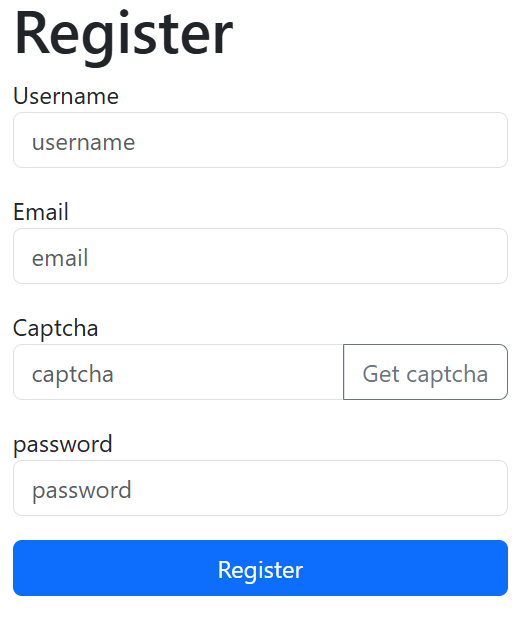
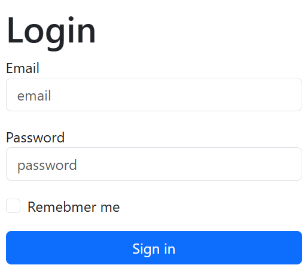
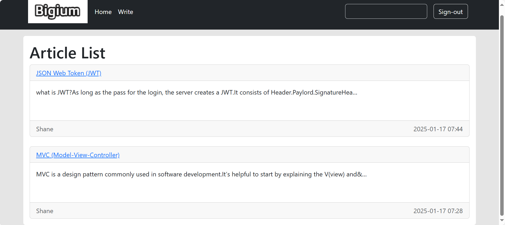
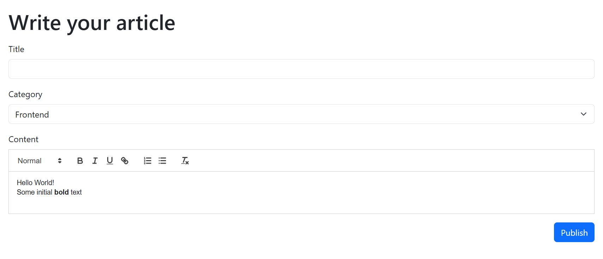
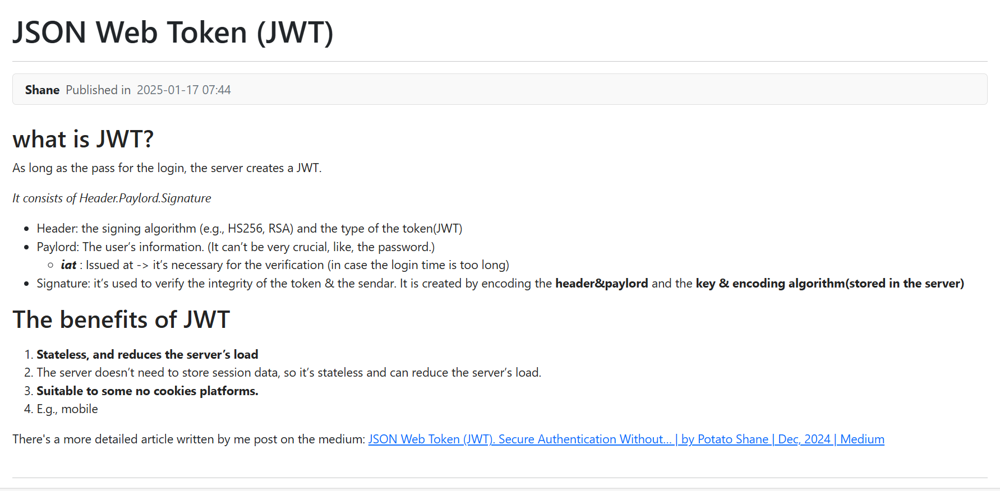
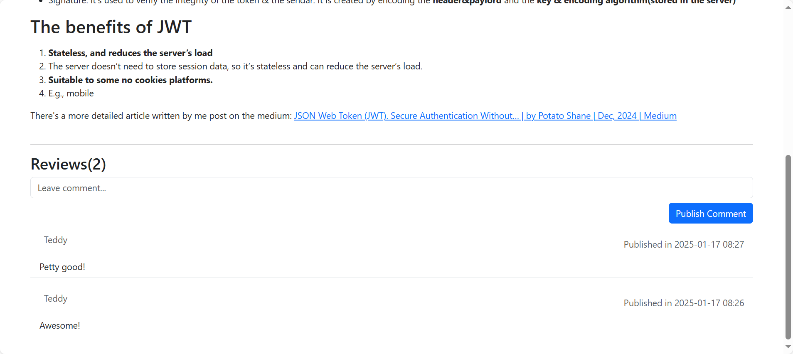

# Social-Publishing-Platform
It allows users to publish articles and share their thoughts with others.

## Features
1. Sign in/sign out (**Sesson**)
2. Remember user's login status
2. Register (Send **Captcha** to email) 
3. User can publish articles.**(RichTextEditor)** 
4. User can review articles.
5. Search articles by title or content. (It will be displayed order by time)

## Tech Stacks
* Backend: Django, PostgreSQL 
* Frontend: HTML, CSS, JavaScript, JQuery
* Tools: Git, Docker

## Display
* Login/Register(send captcha to verify)

* HomePage

* WriteArticle

* ArtiecleContent

* Review

